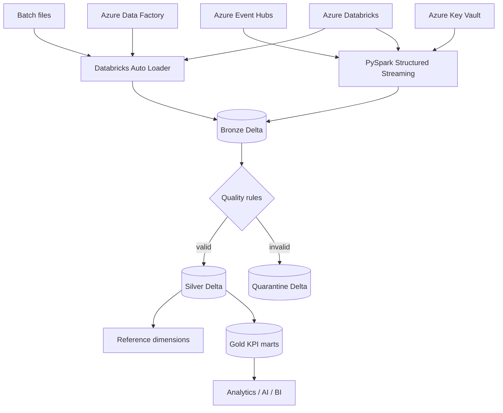
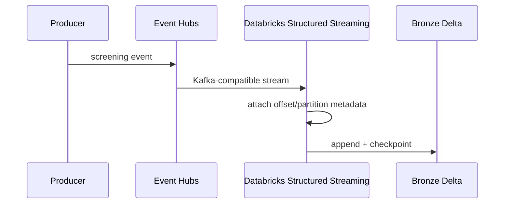

# MedLake Azure PySpark

## Real-Time Healthcare Lakehouse on Azure

**PySpark • Azure Databricks • Delta Lake • ADLS Gen2 • Auto Loader • Event Hubs • Data Factory • Key Vault • Azure Monitor • Terraform • Declarative Automation Bundles • GitHub Actions**

> **Portfolio/data-engineering project using synthetic healthcare events only.**

---

## Why this project exists

This repository demonstrates an end-to-end **Azure data platform**, not another
machine-learning model.

It is designed to show senior-level competence across:

- PySpark;
- batch and streaming ingestion;
- Delta Lake;
- medallion architecture;
- data-quality engineering;
- schema drift;
- ADLS Gen2;
- Azure Event Hubs;
- Azure Databricks;
- Azure Data Factory;
- Azure Key Vault;
- Azure Monitor / Log Analytics;
- Terraform;
- CI/CD and workload identity federation.

---

# Architecture



---

# Synthetic dataset

The repository includes synthetic healthcare screening events plus facility and
patient-reference data.

The main generated dataset contains approximately **20,000 events** and
deliberately includes:

- duplicate event IDs;
- null facility IDs;
- null patient IDs;
- out-of-range confidence values;
- a separate schema-drift file with new columns.

This makes the lakehouse capable of demonstrating realistic engineering failure
modes rather than only clean toy data.

No real patient data are included.

---

# Medallion design

## Bronze — raw / replayable

Bronze preserves source payloads and ingestion metadata.

Batch files are incrementally ingested with **Databricks Auto Loader**.

The example uses:

```python
spark.readStream \
    .format("cloudFiles") \
    .option("cloudFiles.format", "json") \
    .option("cloudFiles.schemaEvolutionMode", "rescue")
```

Unexpected fields are retained in `_rescued_data` rather than silently lost.

## Silver — validated / deduplicated

Silver performs:

- timestamp/type normalization;
- duplicate handling by `event_id`;
- model confidence validation;
- image-quality validation;
- required-key validation;
- data quarantine;
- patient/facility reference dimensions.

Invalid rows are kept in a dedicated quarantine Delta table.

## Gold — business/data products

Gold publishes:

- facility daily screening counts;
- referral counts and rates;
- average model confidence;
- average image quality;
- class mix;
- network summary views;
- pipeline-quality metrics.

---

# Streaming path

The project demonstrates real-time ingestion from **Azure Event Hubs** using its
Kafka-compatible endpoint.



Connection data is expected from a Databricks secret scope, not source code.

---

# Repository structure

```text
medlake-azure-pyspark/
├── src/medlake/
│   ├── contracts.py
│   ├── paths.py
│   ├── quality.py
│   ├── scd.py
│   └── spark_transforms.py
├── jobs/
│   ├── 01_bronze_autoloader.py
│   ├── 02_bronze_eventhubs.py
│   ├── 03_silver_curate.py
│   ├── 04_silver_dimensions.py
│   ├── 05_gold_kpis.py
│   └── 06_gold_quality_observability.py
├── resources/
├── sql/
├── scripts/
├── tests/
├── data/
├── infra/terraform/
├── adf/
├── docs/
├── .github/workflows/
├── databricks.yml
└── pyproject.toml
```

---

# Local validation

Create an environment:

```bash
python -m venv .venv
```

Install:

```bash
pip install -e ".[dev]"
```

Validate:

```bash
python scripts/check_data_contract.py --path data/ci_valid_events.jsonl
ruff check src scripts tests
mypy src
pytest -q
```

Optional local Spark smoke test:

```bash
pip install -e ".[spark]"
python scripts/local_spark_smoke.py
```

---

# Provision Azure infrastructure

```bash
cd infra/terraform
cp terraform.tfvars.example terraform.tfvars
terraform init
terraform fmt -recursive
terraform validate
terraform plan
terraform apply
```

The Terraform stack creates the core portfolio environment:

- resource group;
- ADLS Gen2 storage account with hierarchical namespace;
- landing/checkpoint/archive filesystems;
- Azure Databricks workspace;
- Event Hubs namespace + event hub;
- Azure Data Factory;
- Azure Key Vault;
- Log Analytics workspace;
- diagnostic settings.

---

# Deploy Databricks jobs

This project uses **Databricks Declarative Automation Bundles**.

After replacing storage paths in `databricks.yml`:

```bash
databricks bundle validate --target dev
databricks bundle deploy --target dev
```

For production-style GitHub deployment, the repository includes an OIDC workflow:

```text
.github/workflows/deploy-databricks.yml
```

---

# Publish synthetic streaming events

Install Azure extras:

```bash
pip install -e ".[azure]"
```

Set:

```text
EVENTHUB_CONNECTION_STRING
EVENTHUB_NAME
```

Then:

```bash
python scripts/publish_eventhubs.py \
  --path data/sample_screening_events.jsonl \
  --max-events 100
```

Run the streaming Databricks job and inspect Bronze records.

---

# Data quality

Example rules:

| Rule | Behavior |
|---|---|
| missing event ID | quarantine |
| missing patient ID | quarantine |
| missing facility ID | quarantine |
| confidence outside 0–1 | quarantine |
| quality outside 0–1 | quarantine |
| duplicate event ID | deduplicate |
| new schema fields | rescue in Bronze |

This is important because production data engineering is about **controlling bad
data**, not merely transforming good data.

---

# CI/CD

Every pull request validates:

- Python data contract;
- Ruff;
- mypy;
- pytest;
- Python compilation;
- local Spark smoke test;
- Terraform formatting;
- Terraform initialization and validation.

Separate workflows demonstrate:

- Azure infrastructure deployment with `azure/login@v3` + OIDC;
- Databricks bundle deployment with GitHub OIDC.

No permanent cloud password is required in the repository.

---

# Why this project is valuable for senior roles

| Capability | Evidence |
|---|---|
| PySpark | reusable transforms + Databricks jobs |
| Streaming | Event Hubs + Structured Streaming |
| Incremental ingestion | Auto Loader |
| Lakehouse | Delta + medallion architecture |
| Data quality | quarantine pattern |
| Schema drift | rescued-data example |
| Azure storage | ADLS Gen2 |
| Orchestration | Data Factory |
| Security | Key Vault + OIDC |
| IaC | Terraform |
| Databricks DevOps | Declarative Automation Bundles |
| CI/CD | GitHub Actions |
| Analytics engineering | Gold KPI marts |
| Observability | Log Analytics + quality metrics |

---

# Recruiter-ready summary

> **MedLake Azure PySpark** is a real-time Azure healthcare lakehouse that
> combines PySpark, Delta Lake, ADLS Gen2, Databricks Auto Loader and Event Hubs
> streaming in a Bronze/Silver/Gold architecture. Silver implements
> deduplication and quality quarantine, Gold publishes operational data products,
> Terraform provisions the Azure platform, and Databricks Declarative Automation
> Bundles plus GitHub OIDC provide reproducible CI/CD.

---

## Author

**Ankit Kumar Singh**

Azure Data Engineering • PySpark • Databricks • Delta Lake • Lakehouse • MLOps / Data Platform Engineering

