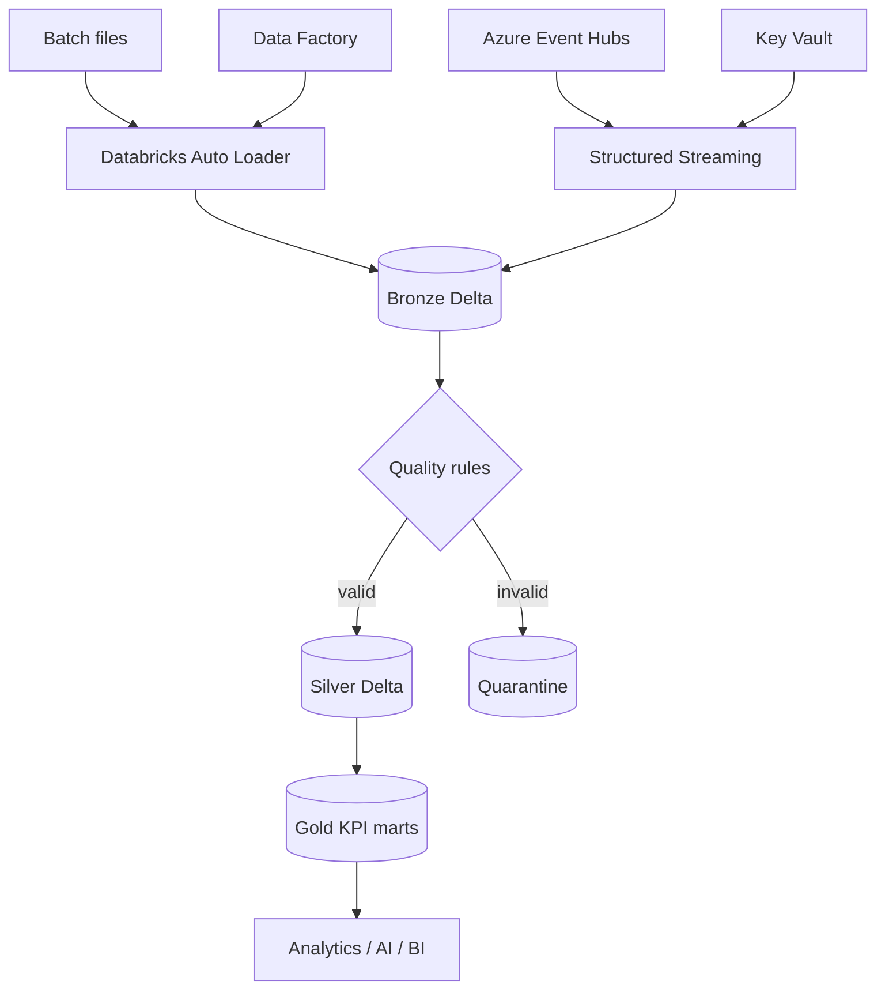

# MedLake Azure PySpark

[](https://github.com/singhankitsrf/MedLake-Azure-PySpark/actions/workflows/ci.yml)  

## Real-Time Healthcare Lakehouse on Azure

**PySpark • Azure Databricks • Delta Lake • ADLS Gen2 • Auto Loader • Event Hubs • Data Factory • Key Vault • Azure Monitor • Terraform • GitHub Actions**

> Portfolio/data-engineering project using synthetic healthcare events only.

## Architecture



## What this repository demonstrates

- batch and real-time ingestion into a Delta Lake medallion architecture
- reusable PySpark data contracts, deduplication and quality quarantine
- schema-drift handling and replayable Bronze storage
- Gold operational KPI/data-quality tables
- Azure infrastructure-as-code with Terraform
- Databricks jobs packaged with a deployable bundle
- GitHub Actions CI/CD using federated/OIDC authentication patterns

## Repository structure

```text
src/medlake/              reusable PySpark/data-quality modules
jobs/                     Bronze, Silver and Gold Databricks jobs
sql/                      Unity Catalog and operational queries
infra/terraform/          Azure platform IaC
resources/                Databricks job resources
adf/                      Data Factory orchestration template
scripts/                  generators, data contracts, local smoke tests
tests/                    unit tests
docs/                     architecture/security/streaming notes
.github/workflows/         CI and deployment workflows
```

## Synthetic data

No real patient data are included. Generate the larger ~20,000-event demonstration dataset locally:

```bash
python scripts/generate_synthetic_data.py --rows 20000 --seed 42
```

## Local quality checks

```bash
python -m venv .venv
source .venv/bin/activate
pip install -e ".[dev]"
ruff check src scripts tests
mypy src
pytest -q
```

## Databricks

```bash
databricks bundle validate --target dev
databricks bundle deploy --target dev
```

## Responsible portfolio statement

Cloud deployment screenshots, performance claims, and cost figures should be added only after they are measured in the owner’s Azure environment.

## Author

**Ankit Kumar Singh** — Azure Data Engineering • PySpark • Databricks • Delta Lake • MLOps / Data Platform Engineering

## Hugging Face deployment and evaluation

See [deployment instructions](docs/HUGGING_FACE.md) and the `hf_space/` application.
The `evaluation/` directory distinguishes measured results from pending image-model evaluation.
